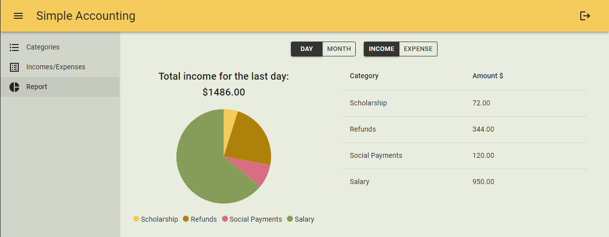

# Simple Accounting

Simple Accounting is a front-end application created with ASP.NET Core Blazor Server.

Simple Accounting [site](https://simpleaccounting.azurewebsites.net) intended to simplify the process of personal finance accounting.
It allows user to save income and expenses data for different financial categories and to get daily and monthly finance reports
 
 
Main features:
* Consumes [AccountingApp API](https://github.com/NikitaRemizov/AccountingApp) 
* The Application is created using *.NET 5*,  *ASP.NET Core 5*, *Blazor Server*, *[MudBlazor](https://www.nuget.org/packages/MudBlazor/)*.

[The link to the site](https://simpleaccounting.azurewebsites.net)
